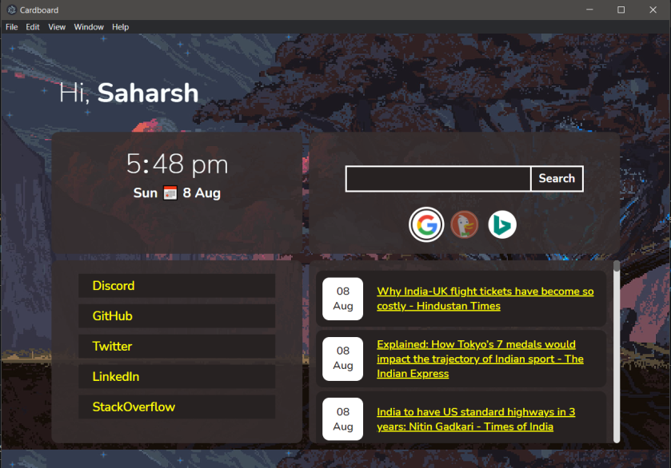

# Cardboard

A minimal desktop utility, I guess.

# Features

- Search from selectable engines (google, duckduckgo and bing)
- Simple date time display
- Quick links
- Quick feeds

Most things are not configurable yet.

# Commands

- `npm run start` - Start the project
- `npm run make` - Build distros (by `electron-forge`)
- `npm run package` - Packaging